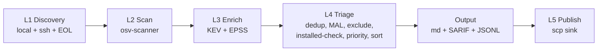

# pkgfence

Multi-codebase dependency and supply-chain vulnerability scanner, delivered as a Claude Code skill.

Scans local repositories and remote SSH targets for known CVEs (via osv-scanner v2 or OSV API fallback), malicious packages (via OpenSSF Malicious Packages `MAL-*` overlays), and behavioral red flags. Produces ranked, triaged reports with copy-pasteable remediation. Calibrated-trust disclaimers and per-finding cards make it explicit what was scanned and what wasn't.

**Status: 🟢 v0.3.0 — Phase 3a (EPSS + triple-score ranking), hardened.** Local + remote SSH scanning, triple-signal risk ranking, auto-publish, and the #7–#20 security/correctness hardening pass.

> **Architecture:** see **[docs/ARCHITECTURE.md](docs/ARCHITECTURE.md)** for the full
> pipeline, data-flow, feed-cache, and safety-boundary diagrams.

## Architecture at a glance



## What works today (v0.3.0)

- `pkgfence scan` against local registry roots AND remote SSH targets in one pass
- Registry CLI: `validate`, `list`, `add-root`, `add-project`, `add-ssh`, `remove`
- `pkgfence ssh precheck <name>` — pre-flight diagnostic for new SSH hosts (reachability, osv-scanner presence + version, discover_paths existence)
- osv-scanner v2 integration with fallback to OSV API querybatch
- Remote SSH scanning (Pattern B: osv-scanner runs on the remote host; only paths, hashes, and scanner JSON transit locally — source code never leaves the host). Per-target batched `find`/`sha256sum`/`osv-scanner`/`ls`, with `ControlMaster` connection reuse on POSIX
- **CVSS vectors decoded to real base scores** via the `cvss` package (V2/V3/V4) — a 9.8 critical is bucketed `critical`, not mis-read as the spec version
- **CISA KEV** `actively_exploited` enrichment (cveID + alias join)
- **EPSS** exploit-probability enrichment (score + percentile) from FIRST
- **Triple-score ranking** — `priority_score = w_cvss·CVSS + w_epss·EPSS + w_kev·KEV` (weights tunable in `config/defaults.yaml`); findings sort by priority within each severity bucket
- **EOL software detection** via a curated catalog (local + remote)
- **Is-installed check** — packages not present on disk are demoted (lower false-positive fatigue), at one unified pipeline position for local and remote
- Expiring exceptions/waivers, hardcoded low-value exclusions, and MAL-* malicious-package override (severity from config)
- Diff-aware baseline scanning (NEW vs EXISTING tagging)
- Markdown report + YAML frontmatter + SARIF 2.1.0 + per-run JSONL audit log
- `pkgfence-notify` — fire a webhook when a run surfaces genuinely-new (or escalated) findings above a threshold
- Resilient threat-intel feeds: validate-before-publish caching, degrade-once, and an operator-visible stale-feed signal
- Hard safety invariants S1, S2, S3, S4 enforced by tests
- Four-state exit codes (0 clean / 1 findings / 2 scanner error / 3 config error)
- **341 tests passing**, every code path TDD-built

## What's deferred (Phase 3b+)

- GitHub mode (api / clone)
- Auto-bootstrap (`pkgfence ssh bootstrap <name>`) — manual osv-scanner install still required for now
- Watch mode (scheduled monitoring + baseline drift detection)
- Audit mode (deep one-shot review with extra scanners)
- Layer 5 fix-recommendation pipeline (LLM recommend → critic review → text doc)
- deps.dev + OpenSSF Scorecard enrichment
- Behavioral heuristics (age, lifecycle scripts, provenance)
- Coarse reachability tiering
- Meta mode (audit `.claude/`, `.cursor/`, `mcp.json`)

These are planned for future phases.

## Repository layout

```
pkgfence/
├── README.md                           ← you are here
├── SKILL.md                            ← Claude Code skill entry point
├── LICENSE                             ← MIT
├── pyproject.toml                      ← Python deps + pytest config
├── .gitignore                          ← state/, .venv/, __pycache__/, .omc/
├── assets/
│   └── scanner-hashes.json             ← G9 soft guard: known-good osv-scanner SHA256
├── config/
│   ├── registry.schema.yaml            ← JSON Schema for registry.yaml
│   ├── registry.example.yaml           ← copy this to state/registry.yaml
│   ├── defaults.yaml                   ← canonical tunables (severity, TTLs, exit codes)
│   └── exclusions.yaml                 ← hardcoded low-value finding categories
├── references/                         ← deep reference docs
│   ├── workflows/scan-mode.md
│   ├── workflows/ssh-mode.md           ← SSH mode workflow (ACL, sudo, publish)
│   ├── scanners/osv-scanner.md
│   └── threat-intel/{cisa-kev.md, osv-api.md}
├── scripts/                            ← Python implementation (see docs/ARCHITECTURE.md §7)
│   ├── discover.py                     ← L1 local discovery
│   ├── discover_remote.py              ← L1 remote SSH discovery (batched sha256sum)
│   ├── eol_detect.py                   ← L1 EOL-software catalog walk (local + remote)
│   ├── scan_local.py                   ← L2 local scanner + CVSS vector decode
│   ├── scan_remote.py                  ← L2 remote scan (one osv-scanner per target)
│   ├── enrich_threats.py               ← L3 CISA KEV overlay
│   ├── enrich_epss.py                  ← L3.5 EPSS score + percentile overlay
│   ├── installed_check.py              ← L4 is-installed check + severity demotion
│   ├── triage.py                       ← L4 dedup / MAL override / exceptions / exclude / sort
│   ├── report.py                       ← markdown report generator (with YAML frontmatter)
│   ├── publish.py                      ← scp publish sink
│   ├── notify.py                       ← pkgfence-notify: webhook on new/escalated findings
│   ├── ssh_precheck.py                 ← ssh precheck CLI
│   ├── compile_requirements.py         ← derive requirements.txt for self-scan
│   ├── registry_cli.py                 ← CLI (validate/list/add-root/add-project/add-ssh/remove)
│   ├── scan_command.py                 ← entry point: pkgfence scan
│   └── lib/                            ← helpers
│       ├── SAFETY_INVARIANTS.md        ← S1/S2/S3/S4 doc
│       ├── logger.py
│       ├── types.py                    ← Finding TypedDict, SEVERITY_RANK, is_status_record, iter_vuln_ids
│       ├── config.py                   ← defaults.yaml loader + shared load_yaml()
│       ├── proc.py                     ← single run_capture() subprocess wrapper (utf-8 safe)
│       ├── frontmatter.py              ← single owner of the report --- frontmatter format
│       ├── priority.py                 ← triple-score priority_score (config-driven weights)
│       ├── purl.py                     ← canonical PURL builder
│       ├── osv_client.py               ← OSV API querybatch + cache + 429 backoff
│       ├── feed_cache.py               ← shared TTL cache + degrade-once base for KEV/EPSS
│       ├── kev_client.py               ← CISA KEV fetch (FeedCacheClient subclass)
│       ├── epss_client.py              ← FIRST EPSS fetch (FeedCacheClient subclass, host allowlist)
│       ├── exceptions.py               ← expiring waivers
│       ├── baseline.py                 ← save/load + NEW/EXISTING diff
│       ├── sarif.py                    ← SARIF 2.1.0 emitter
│       ├── audit_log.py                ← per-run JSONL writer
│       ├── ssh_runner.py               ← SSH runner (shlex-quoted, allowlisted, ControlMaster)
│       ├── remote_types.py             ← RemoteManifest TypedDict
│       └── registry.py                 ← registry load/validate/atomic-write
└── tests/                              ← 341 tests
    ├── conftest.py                     ← shared tmp_state, tmp_registry fixtures
    ├── fixtures/
    │   ├── npm/{vulnerable,clean,corrupted}/
    │   └── python/{vulnerable,clean}/
    ├── test_safety_invariants.py       ← S1/S2/S3 enforcement
    ├── test_s4_no_remote_content_exfil.py ← S4 enforcement
    ├── test_registry_validation.py     ← schema + loader + CLI
    ├── test_registry_cli_ssh.py        ← add-ssh, remove-ssh, list-with-ssh
    ├── test_ssh_runner_extensions.py   ← key_file, use_sudo, port, utf-8 decoding
    ├── test_discover_remote.py         ← remote discovery + node_modules exclusion
    ├── test_scan_remote.py             ← remote osv-scanner orchestration
    ├── test_scan_command_ssh.py        ← end-to-end scan_command + ssh + publish
    ├── test_ssh_precheck.py            ← precheck CLI
    ├── test_publish.py                 ← publish schema + scp sink
    ├── test_purl.py
    ├── test_osv_client.py
    ├── test_kev_client.py
    ├── test_discover.py
    ├── test_scan_local.py
    ├── test_enrich_threats.py
    ├── test_triage.py
    ├── test_exceptions.py
    ├── test_baseline.py
    ├── test_report.py
    ├── test_sarif.py
    ├── test_audit_log_atomicity.py
    ├── test_scan_command.py            ← end-to-end pipeline tests
    ├── test_ecosystems.py              ← Layer A fixture tests (npm, python)
    ├── test_logger.py
    ├── test_types.py
    └── test_config.py
```

## Quick start (local scanning)

```bash
# Bootstrap once
python -m venv .venv && source .venv/Scripts/activate && python -m pip install -e ".[dev]"
scoop install osv-scanner

# Set up your registry
python -m scripts.registry_cli --registry state/registry.yaml add-root D:\projects --tier 1

# Run a scan
python -m scripts.scan_command --registry state/registry.yaml
```

SSH targets are configured in the same registry — see the SSH scanning section below.

## SSH scanning

To scan a remote host, add it to your registry with `add-ssh`:

```bash
python -m scripts.registry_cli --registry state/registry.yaml add-ssh \
  --name myserver --host myserver.example.com --user pkgfence \
  --tier 1 --discover-paths /var/www:/opt/apps
```

Before the first scan, run the pre-flight check:

```bash
python -m scripts.scan_command --registry state/registry.yaml ssh precheck myserver
```

This verifies SSH reachability, osv-scanner presence on the remote (with version validation), and that all `discover_paths` exist.

Then run a normal scan — pkgfence handles local and SSH targets in one pass:

```bash
python -m scripts.scan_command --registry state/registry.yaml
```

For the full SSH workflow including ACL patterns, sudo configuration, manual osv-scanner install, and publish setup, see `references/workflows/ssh-mode.md`.

## Hard safety invariants

`pkgfence` enforces four architectural invariants by tests that cannot be skipped:

- **S1**: SSH unreachable raises `SSHUnreachableError`, never silently runs the command locally as a substitute. Tested by `test_no_silent_local_fallback_when_ssh_unreachable`.
- **S2**: Never executes `npm install`, `pip install`, `cargo install`, `gem install`, `bundle install`, or `go install` commands. Tested by `test_no_package_manager_install_anywhere_in_scripts` (static regex scan of all `scripts/**/*.py`).
- **S3**: SSH targets only allow commands in a fixed allowlist (`find, cat, sha256sum, ls, stat, osv-scanner, trivy, zizmor`). Tested by `test_ssh_command_allowlist_refuses_disallowed_commands`.
- **S4**: Remote scripts never retrieve file contents — only paths, hashes, and scanner JSON transit. `scp`/`rsync`/`sftp`/`dd`/`cat <manifest>` patterns are banned. Tested by `test_s4_no_remote_content_exfil.py` (static regex scan).

See `scripts/lib/SAFETY_INVARIANTS.md` for the full doc.

## License

MIT. See `LICENSE`. Permissive license enables third-party audit, which matters because "scanners are now targets" per the TeamPCP attack on Trivy/KICS (Round 3 research).

## Motivation

Two real incidents drove this skill into existence:

1. The 2025 Shai-Hulud npm worm that bricked ~5-6 MacBook Pros by exfiltrating secrets and (in some failure modes) `rm -rf $HOME` via postinstall scripts.
2. A separate SSH server breach via a compromised node dependency in code the operator did not deploy.

Phase 2 SSH support closed the loop on the second class. During tier-1 dogfood, pkgfence caught a real malicious package (`MAL-2023-462 fsevents@1.2.4`) on a Plesk host's legacy Pydio installation.

## Documentation

| Document | Description | Audience |
|----------|-------------|----------|
| [README.md](README.md) | Project overview, quick start | User, Developer |
| [docs/ARCHITECTURE.md](docs/ARCHITECTURE.md) | Pipeline, data-flow, feed-cache, and safety-boundary diagrams | Developer, AI |
| [CONTRIBUTING.md](CONTRIBUTING.md) | How to contribute: bugs, enhancements, PR process, safety invariants | Developer |
| [DEVELOPMENT.md](DEVELOPMENT.md) | Developer environment setup, testing, conventions, troubleshooting | Developer |
| [SKILL.md](SKILL.md) | Claude Code skill definition for invoking pkgfence from other projects | AI |
| [CHANGELOG.md](CHANGELOG.md) | Release history (v0.1.0 through current) | User, Developer |
| [AGENTS.md](AGENTS.md) | AI agent navigation and conventions across all modules | AI |
| [config/registry.schema.yaml](config/registry.schema.yaml) | Registry YAML JSON Schema | Developer |
| [config/registry.example.yaml](config/registry.example.yaml) | Example registry configuration | User |
| [references/workflows/scan-mode.md](references/workflows/scan-mode.md) | Local scan workflow details | User, Developer |
| [references/workflows/ssh-mode.md](references/workflows/ssh-mode.md) | SSH mode workflow (ACL, sudo, publish setup) | User, Developer |
| [references/workflows/open-source-release.md](references/workflows/open-source-release.md) | Safe private-to-public release workflow | Developer |
| [references/scanners/osv-scanner.md](references/scanners/osv-scanner.md) | osv-scanner integration reference | Developer |
| [references/threat-intel/](references/threat-intel/) | CISA KEV and OSV API threat intelligence docs | Developer |

## Development

- **Test suite**: `python -m pytest -v` (341 tests, all passing)
- **Coverage**: `python -m pytest --cov=scripts --cov-report=term-missing`
- **Lint**: not yet configured (Phase 5)
- **CI**: GitHub Actions workflow at `.github/workflows/test.yml`

To extend pkgfence, follow the TDD discipline used throughout: write the failing test first, run it, watch it fail, write minimal implementation, run it, watch it pass, commit.
