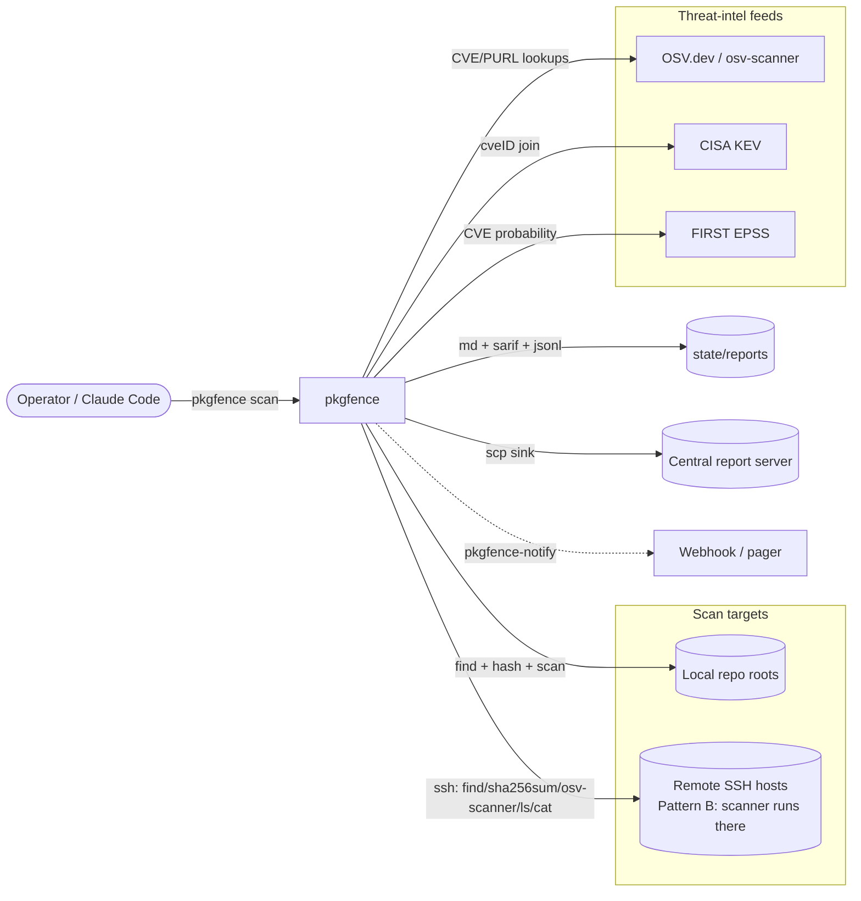
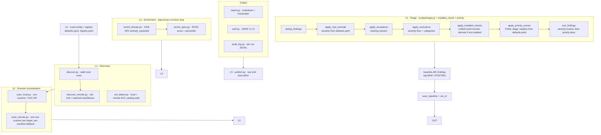
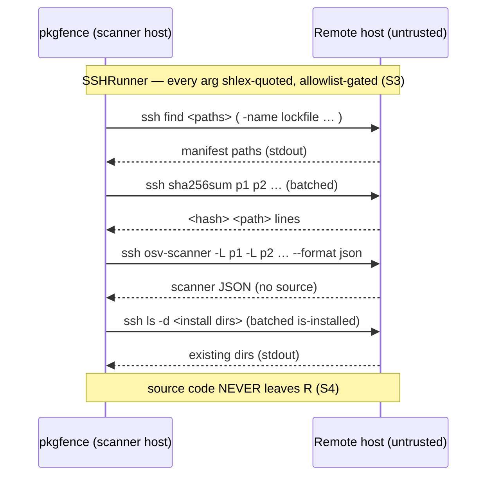
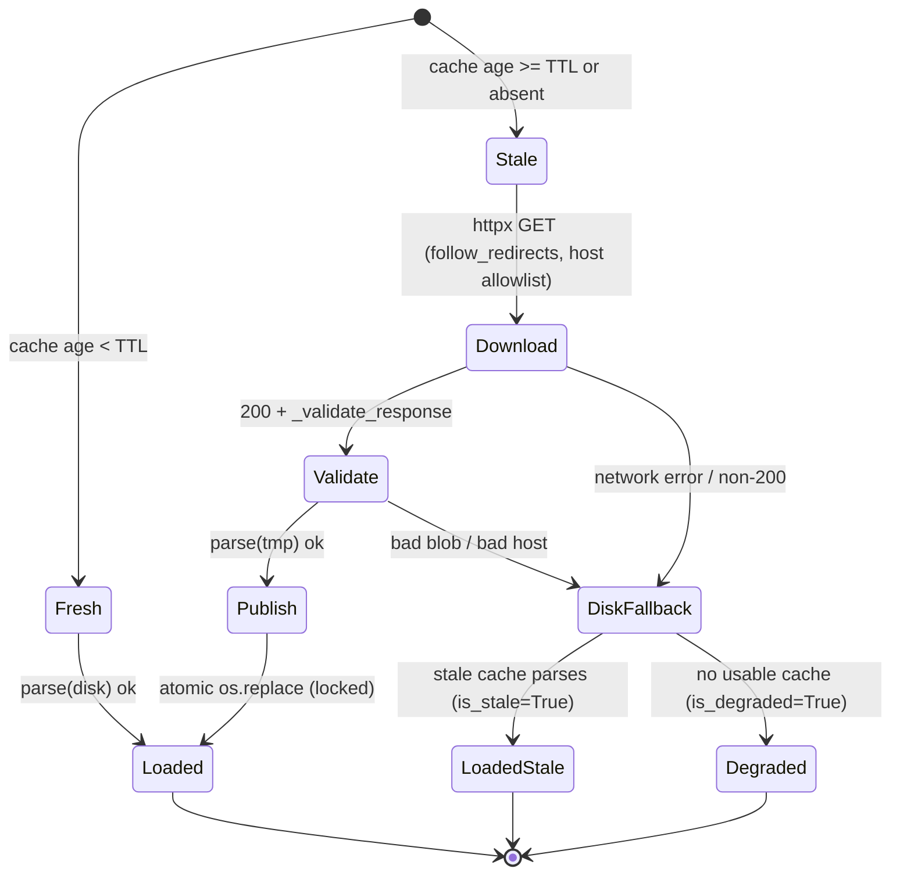
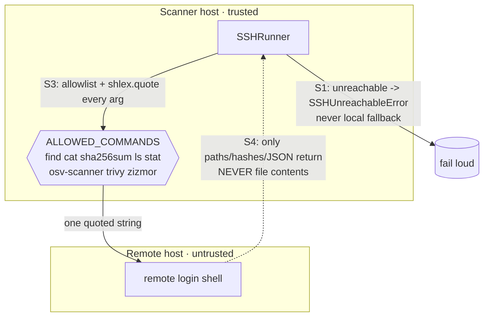

# pkgfence Architecture

> Accurate as of **v0.3.0** (Phase 3a — EPSS + triple-score ranking + the #7–#20
> hardening pass). This document describes how the pieces fit together and why.
> For setup see [DEVELOPMENT.md](../DEVELOPMENT.md); for the agent-facing module
> map see [AGENTS.md](../AGENTS.md).

## 1. What pkgfence is

A dependency- and supply-chain-vulnerability scanner delivered as a Claude Code
skill. It audits **local repositories** and **remote SSH hosts** for known-vulnerable
packages and known-malicious packages, ranks findings by real-world exploit signal,
and publishes calibrated, machine-parseable reports — without ever copying remote
source code back to the scanner.

### System context

The scanner only ever **reads**: it never installs packages (invariant **S2**) and
never retrieves remote file contents (invariant **S4**). See §6.

## 2. The pipeline

`scripts/scan_command.py:run_scan()` is the orchestrator. It runs a fixed sequence
of layers; each layer has a local and (where relevant) a remote variant.

### Ordering decisions that are load-bearing

The exact order inside L4 is not arbitrary — three fixes depend on it:

- **`apply_priority_scores` is the *final* stage** (after MAL override *and*
  installed-check demotion). A malicious package promoted to `critical`, or a
  not-installed critical demoted to `info`, must be scored at its **final**
  severity — otherwise the single most dangerous finding could sort last in its
  bucket. (Issues #11/#15.)
- **The unified installed-check runs *after* exclusions**, matching the local
  position. The shipped exclusions floor drops `info`; demoting *before*
  exclusions would make every "not installed" finding vanish from the report.
  Running after keeps them visible as `INFO (was CRITICAL) … not installed`
  cards on both local and remote paths. (Issue #20.2.)
- **`SCAN_ERROR` status records flow through every stage unchanged** — never
  deduped, enriched, scored, demoted, or excluded — via the single
  `is_status_record()` predicate. One bad manifest produces a diagnostic card,
  never blocks the scan. (Issue #10.)

## 3. The Finding — the type that flows through everything

A single `Finding` (`scripts/lib/types.py`, a `TypedDict`) is the unit of currency.
TypedDicts are used over dataclasses because findings round-trip through subprocess
JSON, file I/O, and YAML trivially.

```mermaid
flowchart LR
    raw[osv-scanner JSON<br/>or OSV API] -->|parse_osv_output| f1["Finding<br/>purl, vuln_id, severity, cvss_score"]
    f1 -->|enrich_with_kev| f2["+ actively_exploited"]
    f2 -->|enrich_with_epss| f3["+ epss_score, epss_percentile"]
    f3 -->|apply_mal_override| f4["+ mal_flagged, severity=critical"]
    f4 -->|apply_installed_checks| f5["+ installed, original_severity"]
    f5 -->|apply_priority_scores| f6["+ priority_score"]
    f6 -->|diff_findings| f7["+ diff_status NEW/EXISTING"]
    f7 -->|report / sarif / jsonl| sink[(artifacts)]
```

Severity comes from decoding the **CVSS vector** (`cvss` package, V2/V3/V4) — not
from regex-mining the score string, which silently read a 9.8 critical as the spec
version `3.1` → `low` (issue #9). `SEVERITY_RANK`, the severity ordering used by the
`--fail-on` gate, the notify thresholds, and the triage sort, is defined once in
`lib/types.py`.

## 4. Local vs. remote — Pattern B and the S4 boundary

Remote scanning never copies source code back. `find` + `sha256sum` + `osv-scanner`
run **on the remote host** over SSH; only paths, hashes, and scanner JSON stdout
transit back.

Efficiency: discovery hashing, the is-installed check, and the scan are each **one
batched round-trip per target** (chunked), and on POSIX an SSH `ControlMaster`
multiplexes them over a single TCP+auth session (issue #19).

`eol_detect` is the one module allowed a scoped `cat` (S4a) to read version files —
constrained to paths under `discover_paths` (no traversal) and validated to yield a
single version-shaped token, so at most one short string can ever transit.

## 5. Threat-intel feed lifecycle

KEV and EPSS share one base class, `FeedCacheClient` (`scripts/lib/feed_cache.py`):
a TTL'd on-disk cache, lazy load, and a **degrade-once** contract.

Correctness properties (issue #12): the downloaded blob is **parsed/validated before
it is published** (temp file → validate → atomic rename under a lock), so a corrupt
HTTP 200 can never poison the cache or be marked fresh. A feed outage degrades the
scan **once per run**, never once per finding. A served-but-expired cache surfaces an
operator-visible `is_stale` signal distinct from `is_degraded`. With zero CVE
findings the EPSS feed is never even downloaded.

## 6. Safety invariants (load-bearing)

These are enforced by tests that must always pass; if one fails the tool is broken.

| # | Invariant | Enforced by |
|---|-----------|-------------|
| **S1** | SSH unreachable → `SSHUnreachableError`, never a silent local fallback | `ssh_runner.py` + `test_safety_invariants.py` |
| **S2** | No package-manager install (`npm/pip/cargo/gem/bundle/go install`) anywhere in `scripts/` | static regex over `scripts/**/*.py` |
| **S3** | SSH commands limited to a fixed allowlist; every argument `shlex.quote`d before the remote shell; NUL/CR/LF rejected | `ALLOWED_COMMANDS` frozenset + quoting in `ssh_runner.py` |
| **S4** | No remote file-content exfiltration (no `scp`/`rsync`/`sftp`/`dd`/`cat <manifest>`) | static regex in `test_s4_no_remote_content_exfil.py`; `eol_detect` cat is the scoped S4a exception, path- and token-constrained |

## 7. Module map

| Layer | Module | Responsibility |
|-------|--------|----------------|
| Orchestrator | `scan_command.py` | wires L0–L5, owns `run_scan()`, exit codes |
| L1 local | `discover.py` | walk registry roots, find manifests by ecosystem |
| L1 remote | `discover_remote.py` | ssh `find` + batched `sha256sum` (paths/hashes only) |
| L1 EOL | `eol_detect.py` | curated EOL-software catalog walk (local + remote, S4a) |
| L2 local | `scan_local.py` | osv-scanner subprocess / OSV API fallback; CVSS vector decode |
| L2 remote | `scan_remote.py` | one osv-scanner invocation per target, per-manifest fallback |
| L3 | `enrich_threats.py` | CISA KEV `actively_exploited` (cveID + alias join) |
| L3.5 | `enrich_epss.py` | EPSS score + percentile for CVE findings |
| L4 | `triage.py` | dedup, MAL override, exceptions, exclusions, sort |
| L4 | `installed_check.py` | unified is-installed check + severity demotion |
| L4 | `lib/priority.py` | triple-score `priority_score` (weights from config) |
| Output | `report.py` | markdown report + YAML frontmatter |
| Output | `lib/sarif.py` | SARIF 2.1.0 emitter |
| Output | `lib/audit_log.py` | per-run JSONL audit record |
| L5 | `publish.py` | scp sink (best-effort, never blocks) |
| Notify | `notify.py` | compare runs, fire webhook on genuinely-new findings |
| Infra | `lib/feed_cache.py` | shared TTL cache + degrade-once for KEV/EPSS |
| Infra | `lib/ssh_runner.py` | allowlisted, shlex-quoted SSH command runner |
| Infra | `lib/proc.py` | single `run_capture()` subprocess wrapper (utf-8 safe) |
| Infra | `lib/config.py` | `load_defaults()` + shared `load_yaml()` |
| Infra | `lib/frontmatter.py` | single owner of the report `---` frontmatter format |
| Infra | `lib/types.py` | `Finding`, `SEVERITY_RANK`, `is_status_record`, `iter_vuln_ids` |
| Infra | `lib/{purl,baseline,exceptions,registry,osv_client,kev_client,epss_client,remote_types,logger}.py` | supporting helpers |
| Self-scan | `compile_requirements.py` | derive `requirements.txt` from `pyproject.toml` for self-scan |

## 8. Exit codes

| Code | Meaning |
|------|---------|
| 0 | clean — no findings at or above `--fail-on` |
| 1 | findings present at or above `--fail-on` |
| 2 | scanner error (a real one, not exit-1-vulns) |
| 3 | configuration / registry error |

`SCAN_ERROR` records never raise the exit code on their own — they are diagnostics,
not failures.
